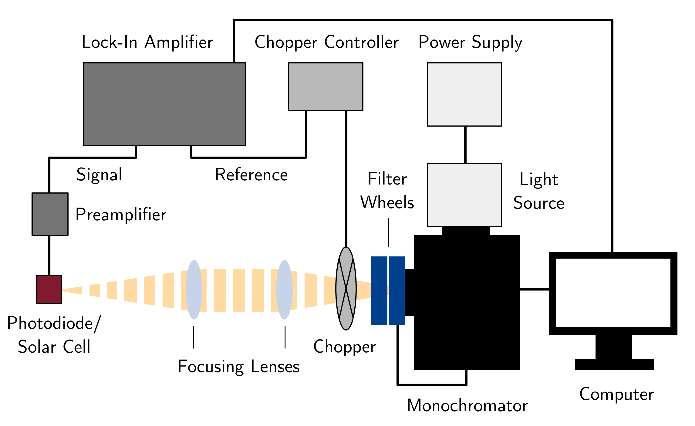

Hardware
========

Overview
--------

  
Schematic of the custom-built sEQE setup used in this work. White light from a tungsten-halogen light source is directed into a monochromator and split by wavelength. The monochromatic light is subsequently modulated by a chopper wheel and focused onto the device under testing (i.e. a solar cell or reference photodiode). When measuring OSCs, the devices are either loaded into a standard sample holder for room temperature measurements or connected inside a cryostat to perform temperature-dependent sEQE measurements. The resulting photocurrent is pre-amplified and converted to a voltage, before being analyzed further by a Lock-In amplifier

.. image:: ../_static/Photo-EQE-Setup-Labelled.png
  :width: 700
  :alt: Photograph of the sEQE setup without cryostate from above.
  
Photo of the custom-built sensitive EQE setup used in this work. The individual components are numbered as (1a) tungsten-halogen light source, (1b) light source power supply, (2) monochromator, (3a) monochromator filter wheel, (3b) long-pass filter wheel, (4a) chopper wheel, (4b) chopper wheel power supply, (5) focusing lenses, (6) rail, (7) custom-built sample holder, (8) sample holder stage, (9) BNC cables with crocodile clips, (10) preamplifier, (11) Lock-In amplifier, (12) measurement computer and (13) black encasing.

Individual parts
----------------

The individual parts used in the AFMD setup include, labeled according to picture: 

	1. Princeton Instruments, TS-428, 250 W tungsten-halogen light source
	2. Princeton Instruments, Spectra-Pro HRS300, Triple Grating Imaging Spectrograph with the following add-ons:
		+ Princeton Instruments, spectral gratings 300/750/1600 nm blaze wavelength and 600 g/mm each
	3. Princeton Instruments, FA2448 Filter Wheel and Thorlabs, FW102C Motorized Filter Wheel with the following add-ons: 
		+ edge pass filters: Thorlabs, FESH0700, FESH1000, FELH0950
		+ long-pass filters: Thorlabs, FGL665, FGL715, FGL780, FGL850, FGL1000
	4. Stanford Research Systems, SR540, Optical Chopper
	5. Thorlabs, ID20/M Mounted Standard Iris an Thorlabs, LB1904 Bi-Convex Lens
	6. Zürich Instruments, HF2TA Current Amplifier
	7. Zürich Instruments, HF2LI Lock-In Amplifier
	
	
3D printed sample holder
------------------------

.. image:: ../_static/Sample_holder_All.png
  :width: 700
  :alt: Photographs of the sample holder from multiple angels. 
  
Photo of the custom-built sample holder used in this setup. The device is placed in a 3D printed sample box, contacted by a conducting spring system, and secured via a top cover (here red) and two side clips (here black). Connection to individual devices is achieved via crocodile clips.
The sEQE setup's sample holder is custom design by Grey and the 3D printed parts can be found in the `AFMD small projects subrepository <https://github.com/AFMD/smallProjects/tree/master/singleSubstrateHolder/newSSHolder>`_ . These parts were designed in OpenSCAD and the code of the programms unique programming language resides in the .scad files. The holder was printed with PLA plastic fillament using an Ultimaker 2 printer. The printed circuit boards were designed using KiCAD software and manufactured by JLCPCB.

Cryostate
---------

.. image:: ../_static/Photo-EQE-Setup-Labelled-With-Cryostat.png
  :width: 700
  :alt:  Photograph of the sEQE setup with cryostate from above.
  
Photo of the custom-built sensitive EQE setup used in this work. The individual components are numbered as (1a) tungsten-halogen light source, (1b) light source power supply, (2) monochromator, (3a) monochromator filter wheel, (3b) long-pass filter wheel, (4a) chopper wheel, (4b) chopper wheel power supply, (5) focusing lenses, (6) rail, (7a) croystat chamber - sample holder, (7b) liquid nitrogen dewar, (7c) liquid nitrogen pump, (7d) cryostate control, (8) sample holder stage, (9) BNC cables, (10) preamplifier, (11) Lock-In amplifier, (12) measurement computer and (13) black encasing.

