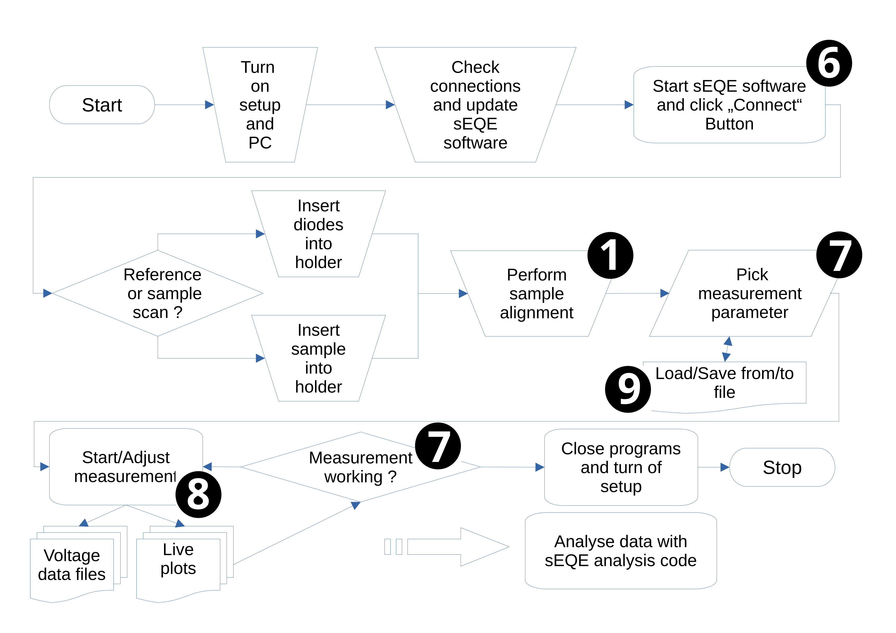

Usage
=====

The setup is running on Linux and Windows. Mac compatibility for the Analysis code is currently in development. 
A schematic of the operational workflow of a sEQE measurement is shown below. The numbers refer to the sections in the graphical user interface - see :doc:'../control_generated/modules' - that perform the corresponding operations. After instrument initialisation, the user can perform measurements of reference diodes or samples under testing. This requires alignment of the sample and selection of measurement parameters. During the measurement, live plots show measurement progress. Once the measurements are finished, detailed data analysis can be performed, for instance using our custom-written sEQE analysis code

  
The pdf embedded is the AFMD's user manual and is meant as an example on how to use the sEQE setup. However, the document contains multiple AFMD specific references which are not needed for third party users and can thus be ignored. A more general version of the user manual is being developed. 

:pdfembed:`src:../_static/sEQE_measurement_User_Guide.pdf, height:800, width:650, align:middle`.
