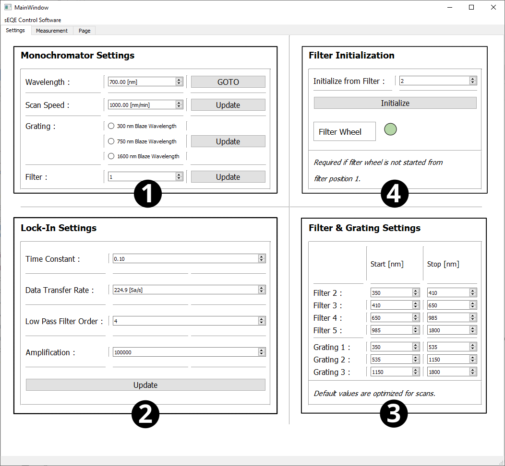

sEQE-Control-Software
=====================

Prerequists
------------
Requirements to run the sEQE control code are mentioned in the project's requirement file. The control code is written in Python 3.9. Furthermore, the program "LabOne" by zurich instruments is needed to control and monitor the Lock-In amplifier, e.g. during alignment.

Description
-----------

The sEQE Setup is operated by a python script, creating a Graphical User Interface (GUI) enabling user input of measurement parameter.
The GUI setup starts by a connection process started via the buttons in box 6: the monochromator, the lock-in amplifier and the second filter wheel get initialised, enabling the user afterwards to change the setup standard settings (box 1-3), experiment naming (box 5) and measurement parameter (box 7).
The monochromator’s filter position, wavelength and the lock-in amplification are used during alignment of the setup.
The measurement specific parameter are set in box 7 and can be imported like the experiment naming from .csv or .txt files (box 5 and 9). The measurement parameter include: 

1. Secondary filter to be used. Each secondary filter will yield a single measurement with the following parameter.
2. Start and stop of wavelength scan
3. Step size of the monochromator 
4. Signal amplification by the pre-amplifier
    
Each second filter ticked in the GUI will create an own data file.
Box 4 enables the user to reset the first filter wheel if the GUI was started while the monochromator's filter wheel was not in the correct starting position.
The terminal serves during the measurement as the base for the code logger, offering the user a constant monitoring of the setup's internal method execution and raised errors. The user can start and stop a measurement with box 8 buttons.

  
.. image:: ../_static/Screenshot-Master-GUI-Page-2.png
  :width: 700
  :alt: Screenshot of the sEQE control GUI's seconde page.

Code
----

.. toctree::
   :maxdepth: 4

   GUI_template
   lockin
   monochromator
   sEQE
